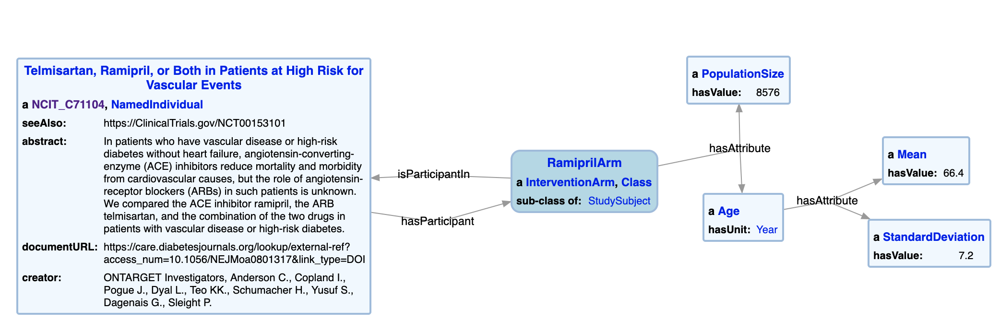

[Annotated Table 1 Example](#annotatedtable) [Link to Table 1 KG ](#linktotable) [Modeling Examples](#modelingexample) 

<article class="mb-5" id="annotatedtable">
<content>
<h2>Annotated Table 1 Example</h2>

  
An annotated example of Table 1 from a clinical trial "Telmisartan, ramipril, or
both in patients at high risk for vascular events" [50] cited in the Cardiovascular Complications (Chapter 9) of the ADA 2018 CPG

<ul>
  
 </ul>
 </content>
 
 
 <article class="mb-5" id="linktotable">
<content>
<h2>Table 1 KG </h2>
<ul>
  
  
Visualizing the RDF representation for an age characteristic with the descriptive statistics for the Ramipril study arm, of the "Telmisartan, ramipril, or
both in patients at high risk for vascular events" clinical trial

 </ul>
  
<strong>Link to a knowledge graph of Table 1s for the various papers -> </strong> <a href="https://raw.githubusercontent.com/tetherless-world/study-cohort-ontology/master/KnowledgeGraph/Table1KG">

 </content>

<article class="mb-5" id="modelingexample">
  <content>
<h2> Modeling Examples</h2>
<ul>
   <h3> Modeling of Collections of Study Subjects </h3>
  
   <strong> Listing 1: Sample RDF N-Triples representation snippet of the Ramipril intervention arm </strong>
   <pre>
   sco-i:RamiprilArm
        a                      owl:Class, sco:InterventionArm; 
        rdfs:subClassOf        sio:StudySubject;
        sio:isParticipantIn    sco-i:TelmisartanRamiprilStudy;   
       sio:hasAttribute    
       [ a sco:PopulationSize; sio:hasValue 8576] .
  </pre>
  
  <strong> Listing 2: Representation of a sub-population within a study arm </strong>
   <pre>
  sco-i:AsianSubPopulation a owl:Class;
        rdfs:subClassOf sco-i:RamiprilArm;
        rdfs:subClassOf 
        [ 
            a owl:Restriction; 
            owl:onProperty sio:hasAttribute;
            owl:someValuesFrom chear:Asian
        ];
     sio:hasAttribute
     [ 
        a sco:PopulationSize; 
        sio:hasValue 1182; 
        sio:hasAttribute 
        [ 
            a sio:Percentage; 
            sio:hasValue 13.8 
        ] 
    ] .
    </pre>

   <h3> Modeling of Subject Characteristics </h3>
   <h3> Modeling of Aggregations on Subject Characteristics</h3>
 </ul>
 </content>
 
  

